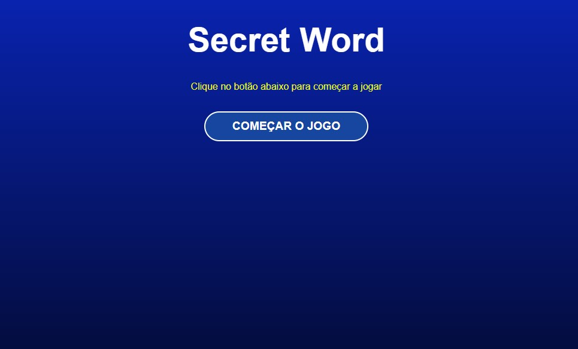

# game-secret-word-react
Bem-vindo ao "Game Secret Word" - será desenvolvido utilizando React

#

****** PROJETO *********

Este é um emocionante jogo de adivinhação desenvolvido em React, onde os jogadores tentam adivinhar a palavra secreta. Com uma interface interativa e amigável, os usuários podem desfrutar de horas de diversão tentando decifrar a palavra oculta.

Principais recursos:

* Interface intuitiva e responsiva, criada com React para uma experiência de usuário fluida em diferentes dispositivos.
* Possibilidade de escolher entre diferentes níveis de dificuldade, desafiando tanto jogadores casuais quanto aqueles em busca de desafios mais complexos.
* Banco de palavras expansível, permitindo uma variedade de palavras secretas para manter o jogo interessante e dinâmico.
* Sistema de pontuação para acompanhar o desempenho dos jogadores e incentivar a competição saudável entre amigos.
  
Junte-se a nós e teste suas habilidades de adivinhação no "Game Secret Word React"!

- Página Inicial


   ##

## Prerequisites

✔ - Node 18.10.0

## Quick Start

```
  
  Rodar o comando para instalar as dependências na pasta principal do projeto: npm install

  Rodar Projeto - npm start
  
```
